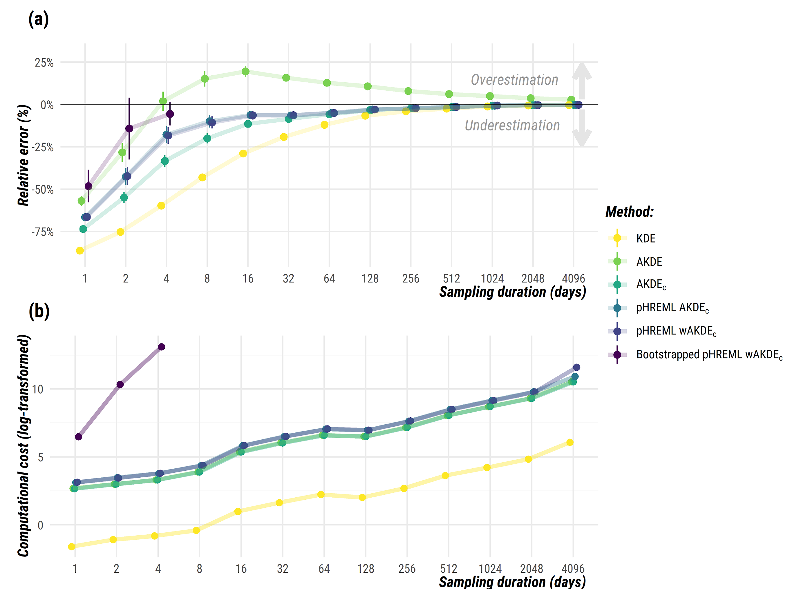

<h1 align="center">
  &nbsp;Autocorrelation-informed home range estimation:<br> a review and practical guide</h1>
<div align="center">

&nbsp;&nbsp;&nbsp;
<a href="https://besjournals.onlinelibrary.wiley.com/doi/10.1111/2041-210X.13786"></a>&nbsp;&nbsp;&nbsp;
<a href="mailto:i.simoes-silva@hzdr.de"></a>&nbsp;&nbsp;&nbsp;
<a href="https://twitter.com/ecoisilva"></a>&nbsp;&nbsp;&nbsp;

</div>

# About:

This repository is a companion piece to the manuscript *"Autocorrelation-informed home range estimation: a review and practical guide"*, published in [Methods in Ecology and Evolution](https://besjournals.onlinelibrary.wiley.com/doi/10.1111/2041-210X.13786). Preprint is also available on [EcoEvoRxiv](https://ecoevorxiv.org/23wq7/), so click [here](https://ecoevorxiv.org/23wq7/download) to download the full-text.

> Home range estimation is a key output from tracking datasets, but the inherent properties of animal movement can lead traditional methods to under- or overestimated their size. **Autocorrelated Kernel Density Estimation (AKDE)** methods were designed to be statistically efficient while explicitly dealing with the complexities and biases of modern movement data, such as *autocorrelation*, *small sample sizes*, and *missing or irregularly sampled data*.

Here, we provide:

1. [R tutorial](https://ecoisilva.github.io/AKDE_minireview/code/AKDE_R-tutorial.html) as a GitHub page (or as a [.pdf](files/SuppFile2_R-tutorial.pdf) file).
2. Simulation [data](data/data_sims.csv) and corresponding [R script](code/AKDE_sims.R).

### Citation:
> Silva, I., Fleming, C. H., Noonan, M. J., Alston, J., Folta, C., Fagan, W. F., & Calabrese, J. M. (2021). Autocorrelation-informed home range estimation: A review and practical guide. Methods in Ecology and Evolution. https://doi.org/10.1111/2041-210X.13786

# R tutorial:

The **AKDE** family of home range estimators will be run using `R` software and the `ctmm` package (Calabrese *et al.*, [2016](https://besjournals.onlinelibrary.wiley.com/doi/full/10.1111/2041-210X.12559)). If you are not familiar with `R`, make sure you follow these steps:

1. Install `R` from <https://www.r-project.org>.
2. Install `RStudio Desktop` from [here](https://rstudio.com/products/rstudio/download/#download) for a graphical interface for `R`.
3. Install the required `R` packages with the following code:

```r
install.packages("ctmm")
```
We provide a guide to **home range estimation** using the following workflow:

-  **Step 1.** -- Formatting and loading an animal tracking dataset;
-  **Step 2.** -- Checking for the *range residency* assumption;
-  **Step 3.** -- Selecting the best-fit movement model through *model selection*;
-  **Step 4.** -- Feeding a movement model into the *home range estimator*;
-  **Step 5.** -- Evaluating additional *biases*, applying *mitigation measures*.

Click [here](https://ecoisilva.github.io/AKDE_minireview/code/AKDE_R-tutorial.html) for the tutorial as a GitHub page (or [here](files/SuppFile2_R-tutorial.pdf) as a .pdf file).
 
# Simulations:

> To quantify the level of improvement offered by each mitigation measure and to explore the tradeoff between accuracy and computational cost, we performed a detailed simulation study. For more details, check our manuscript [here](https://www.biorxiv.org/).



## Metadata

The [:file\_folder: **data**](/data) directory contains:

  - [:memo: data_sims.csv](data_sims.csv): Output from simulations. 
	- `method` - home range estimator method
	- `duration`  - sampling duration (in days)
	- `bias` - difference between the 95% home range estimate and the true 95% area
	- `cost` - computational cost (in seconds)
	- `relArea` - Relative home range area (true home range area is scaled to 1)
	- `error` - Relative error of home range area
	- `tau_p` - position autocorrelation timescale (in sec)
	- `tau_v` - velocity autocorrelation timescale (in sec)
  - [:memo: example_data_longlat.csv](example_data_longlat.csv): Example dataset with coordinates as latitude/longitude. 
  - [:memo: example_data_utm.csv](example_data_utm.csv): Example dataset with UTM coordinates.

# Useful links:

- [Coding Club](https://ourcodingclub.github.io/tutorials.html): collection of coding tutorials with examples in R.
- [`learn` R package](https://rstudio.github.io/learnr/): interactive tutorials for R.

For further documentation on using the `ctmm` package:
- https://cran.r-project.org/web/packages/ctmm/ctmm.pdf
- https://ctmm-initiative.github.io/ctmm/
